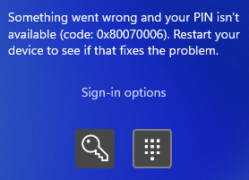
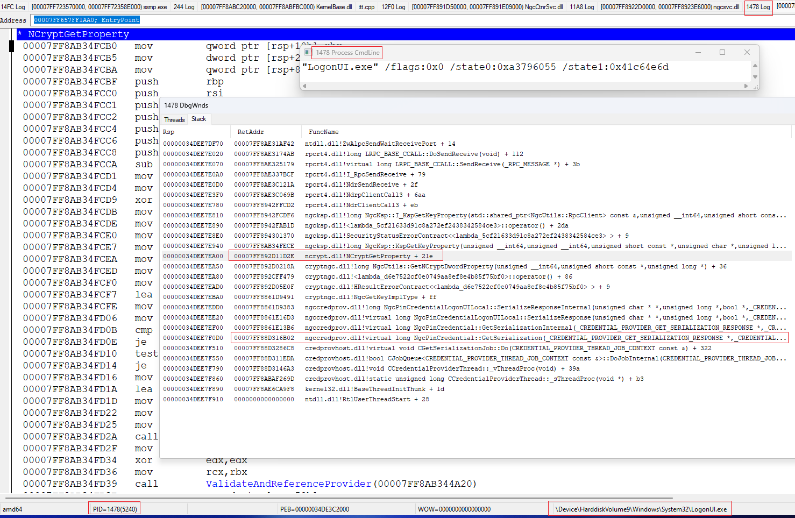
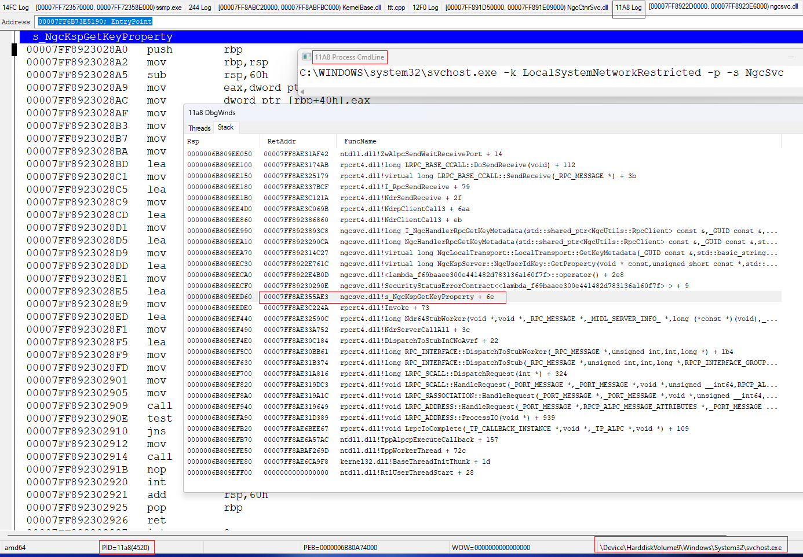
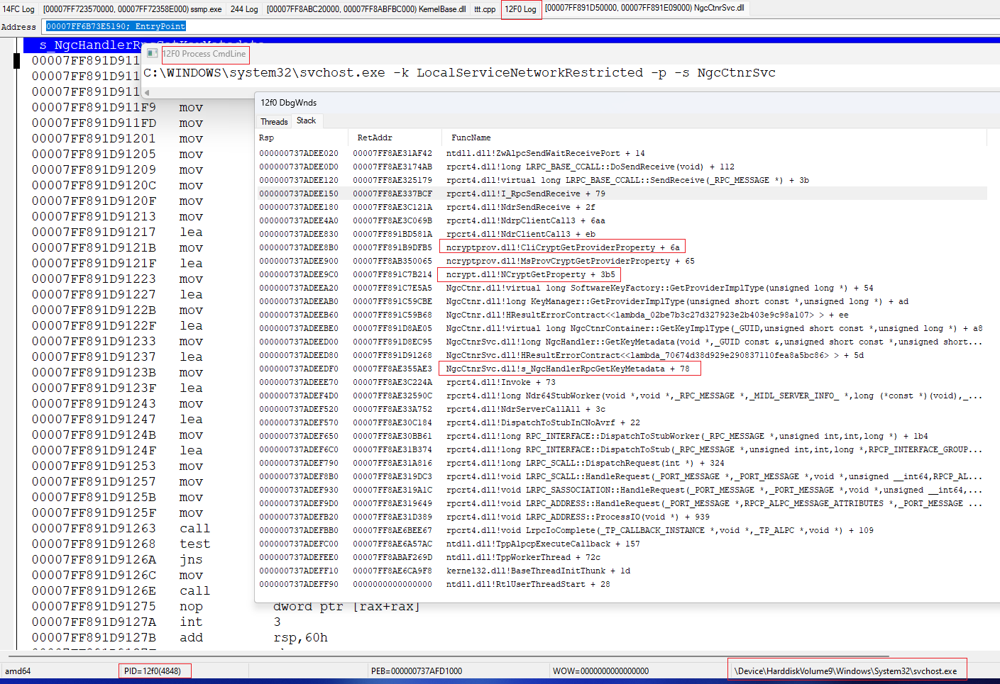
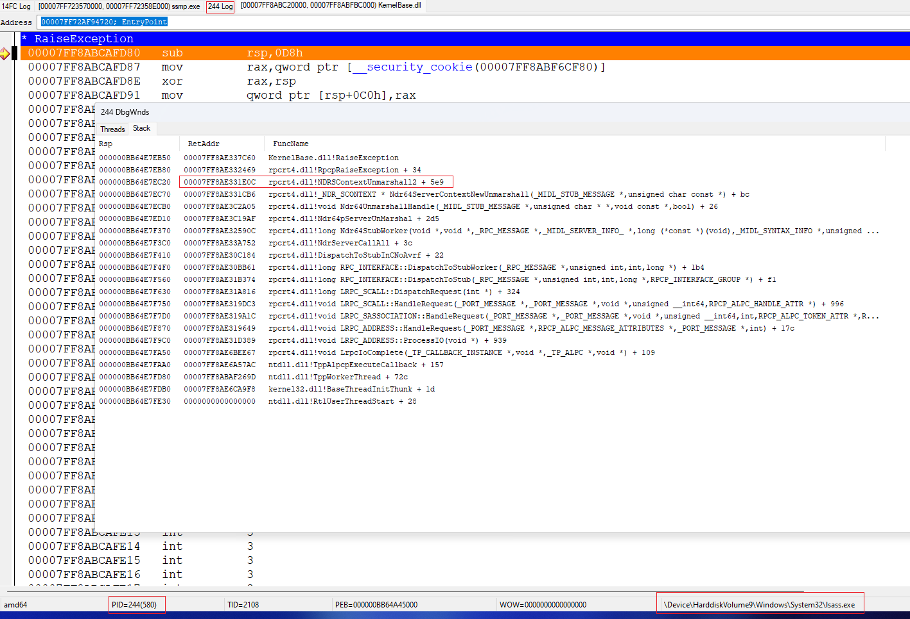

when we call `NCryptOpenStorageProvider(&hProvider, pszProviderName, 0)`

dll from 
`HKEY_LOCAL_MACHINE\SYSTEM\CurrentControlSet\Control\Cryptography\Providers\pszProviderName\UM @ Image` (REG_SZ) is loaded and used via `NCRYPT_KEY_STORAGE_FUNCTION_TABLE`
returned by `GetKeyStorageInterface` exported from this dll

in case MS_KEY_STORAGE_PROVIDER ("Microsoft Software Key Storage Provider") this is ncryptprov.dll

when it NCRYPT_KEY_STORAGE_FUNCTION_TABLE::OpenProvider (this is point to `ncryptprov.MsProvCryptOpenProvider_KeyIso` function ) is called **first time** - `KeyIsoServerBind` called, which is case some data
it released only inside `KeyIsoServerUnbind` ( `KeyIsoServerUnbind <- MSProvModuleUninit <- UninitializeCNGProv <- DLL_PROCESS_DETACH` ) when ncryptprov.dll is unloaded.
but ncrypt.dll never unload dlls, loaded inside NCryptOpenStorageProvider..

as result if we restart KeyIso service, the ncryptprov stop working, until it used data prom previous call to `KeyIsoServerBind`, until unload (i.e. process end)

but sometimes even process end not help, if we use ncryptprov indirect, from another process, which not end. as example LogonUI - it restart every time, when we unlock/logon. but it stop working until not restart NgcCtnrSvc service

i enter PIN in logon UI (logonUI.exe)

and view next error

if attach debugger to lsass.exe ( KeyIso service run inside it) i view exception raised ( `ERROR_INVALID_HANDLE` ), every time on PIN enter

i look under debugger from where lsass was called ( this is chain from 4 (!) processes ). now i describe it in reverse order

ngccredprovider call `RequestSerialization` and `NgcPinCredential::GetSerialization` called on it

internally `NCryptGetProperty` is called which lead to `NgcKsp::KspGetKeyProperty` in ngcksp.dll : this mean `NCryptOpenStorageProvider(MS_NGC_KEY_STORAGE_PROVIDER)` is used

this lead to remote call to NgcSvc service (display name "Microsoft Passport")

here `s_NgcKspGetKeyProperty` is called from ngcsvc.dll which is again lead to remote call (`GetKeyMetadata`) to NgcCtnrSvc service ( display name "Microsoft Passport Container")

in NgcCtnrSvc `s_NgcHandlerRpcGetKeyMetadata` is called ( in NgcCntrSvc.dll )

which call internally `NCryptGetProperty` -> `ncryptprov!CliCryptGetProperty` : this mean `NCryptOpenStorageProvider(MS_KEY_STORAGE_PROVIDER)` is used

this is again remote call, to KeyIso service ( "CNG Key Isolation" ) which run in lsass.exe process

but here call is fail inside lsass in very early stage, inside `NDRSContextUnmarshall2` ( raise exeption `ERROR_INVALID_HANDLE` )

because ncryptprov cache handle inside `KeyIsoServerBind`, which became invalid after KeyIso restart

after i restart NgcCtnrSvc PIN again work ok ( NgcSvc not need to restart )
 
